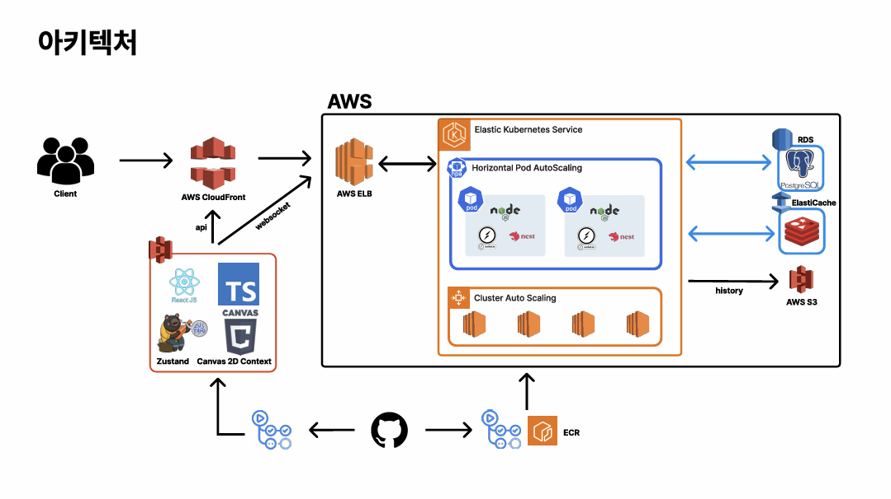

# Pick-Px 백엔드

## 아키텍처



> 전체 시스템의 AWS 기반 인프라, 클라이언트-서버-DB-스토리지 연동 구조를 한눈에 볼 수 있습니다.

## 개요

Pick-Px 백엔드는 실시간 협업 및 게임형 픽셀 드로잉 플랫폼의 서버로, NestJS 기반의 모듈러 아키텍처와 PostgreSQL, Redis, AWS S3 등 최신 인프라를 활용합니다.
대규모 동시 접속, 실시간 데이터 처리, 다양한 이벤트/게임 모드, 보안, 확장성, 유지보수성을 모두 고려하여 설계되었습니다.

---

## 기술 스택 및 주요 의존성

- **프레임워크**: NestJS (TypeScript)
- **DB**: PostgreSQL (TypeORM)
- **캐시/세션/큐**: Redis, BullMQ
- **실시간 통신**: Socket.IO (WebSocket)
- **인증/인가**: JWT, Passport, OAuth (Google 등)
- **API 문서화**: Swagger (OpenAPI)
- **파일 저장**: AWS S3 (aws-sdk)
- **테스트**: Jest (단위/통합/e2e)
- **코드 품질**: ESLint, Prettier, class-validator
- **이미지 처리**: sharp, canvas
- **날짜/시간**: dayjs

---

## 프로젝트 구조

```
backend/
  src/
    app.module.ts         # 루트 모듈, 모든 의존성/모듈 통합
    main.ts               # 서버 부트스트랩, Swagger, CORS, WebSocket, 헬스체크 등
    auth/                 # 인증/인가(JWT, OAuth, Guard, Strategy)
    user/                 # 사용자 관리(회원가입, 정보, 역할)
    group/                # 그룹/채팅/참여자 관리
    canvas/               # 캔버스(생성, 조회, 히스토리, 실시간 브로드캐스트)
    game/                 # 게임형 캔버스(정답/오답, 랭킹, 사망, 상태관리)
    pixel/                # 픽셀 엔티티 및 서비스
    aws/                  # S3 파일 업로드/다운로드
    queues/               # BullMQ 기반 비동기 작업(픽셀, 히스토리 등)
    redis/                # Redis 모듈
    database/             # DB 모듈, TypeORM 설정
    entity/               # 공통 엔티티
    dto/                  # 공통 DTO
    util/                 # 유틸리티 함수
    worker/               # 워커(알람 등)
```

---

## 도메인 및 주요 기능

### 1. **Canvas(캔버스)**
- 다양한 타입 지원: public, event, game 등
- 실시간 픽셀 드로잉/업데이트, 히스토리 관리
- 캔버스별 그룹, 게임, 히스토리 연동
- 캔버스 종료/시작/랭킹/통계 등 다양한 상태 관리

### 2. **User/Group(사용자/그룹)**
- 회원가입, OAuth(구글 등) 지원
- 역할 기반 권한(admin/user/guest)
- 그룹 생성/참여/채팅/초대/퇴장 등
- 그룹별 캔버스, 채팅, 참여자 관리

### 3. **Game(게임형 캔버스)**
- 정답/오답 처리, 소유권 이동, 랭킹 산정
- 사망자 처리, 라이프 차감, 실시간 브로드캐스트
- 게임 상태 변화(시작/종료/랭킹/통계 등) 관리
- 게임 결과 집계 및 히스토리 저장

### 4. **Auth(인증/인가)**
- JWT 기반 인증(Access/Refresh 분리)
- Refresh Token Redis 저장 및 검증
- Passport 기반 OAuth(구글 등) 지원
- Guard/Strategy로 역할별 인가 처리

### 5. **파일 업로드/다운로드**
- AWS S3 연동(이미지 등 파일 저장/조회)
- presigned URL 발급

### 6. **비동기 작업/큐**
- BullMQ 기반 픽셀 업데이트, 히스토리 저장 등 비동기 처리
- 워커 분리 운영

### 7. **헬스체크/모니터링**
- `/health` 엔드포인트: Redis, 서버 상태, 메모리, PID 등 반환
- Swagger(OpenAPI) 문서 자동화 `/api`

---

## 데이터베이스 설계

- **PostgreSQL** 사용, TypeORM 기반 엔티티 관리
- 주요 엔티티:
  - `User`: 사용자 정보, 역할, OAuth
  - `Canvas`: 캔버스 정보, 타입, 상태, 크기
  - `Pixel`: 픽셀 정보(좌표, 색상, 소유자)
  - `Group`: 그룹 정보, 참여자, 채팅
  - `GameUserResult`, `CanvasHistory`: 게임 결과, 캔버스 이력 등
- **마이그레이션**: `backend/sql/schema/` 및 TypeORM migrations 지원

---

## 인증/보안

- **JWT**: Access(15분), Refresh(7일) 분리, Refresh는 Redis에 저장
- **Role 기반 인가**: admin/user/guest 등 역할별 Guard 적용
- **OAuth**: 구글 등 외부 인증 지원
- **환경변수 기반 보안**: .env 파일, 프로덕션/개발 분리
- **CORS**: 프론트 도메인만 허용, credentials 지원
- **비밀번호 암호화**: bcrypt 등 적용(구현부 참고)
- **API 보안**: Swagger BearerAuth, 쿠키/헤더 기반 인증

---

## API 및 실시간 통신

- **REST API**: Swagger 문서 자동화(`/api`)
- **WebSocket**: 실시간 캔버스/게임/채팅 등 양방향 통신
- **헬스체크**: `/health` 엔드포인트 제공(Redis, 서버 상태 등)
- **Swagger 문서**: http://localhost:3000/api

---

## 배포 및 운영

- **Docker/Kubernetes**: 컨테이너 기반 배포, k8s 매니페스트 제공
- **환경별 설정**: 개발/운영 환경 분리, 환경변수(.env) 관리
- **AWS S3**: 이미지 등 파일 저장소로 활용
- **로그/모니터링**: 콘솔 및 외부 연동(추후 확장 가능)
- **CI/CD**: (구현 시 CircleCI, Github Actions 등 연동 가능)

---

## 참고/기타

- **DB 마이그레이션**: `backend/sql/schema/` 참고
- **Kubernetes 배포**: `backend/k8s/` 매니페스트 참고
- **Docker 개발/운영**: `backend/Dockerfile`, `backend/docker-compose.yml`
- **테스트 코드**: `src/**/*.spec.ts`, `test/` 디렉토리 참고

---

# 개발 및 테스트 환경 구축

### 1. 프로젝트 클론 및 의존성 설치

```bash
git clone [YOUR_REPO_URL]
cd pick_px/backend
npm install
```

### 2. 환경변수 파일(.env) 작성

아래 예시를 참고하여 `backend/.env` 파일을 생성하세요.

```env
# NODE_ENV와 PORT는 개발/운영 환경 구분 및 서버 포트 지정에 사용
NODE_ENV=@
PORT=@

REDIS_HOST=@
REDIS_PORT=@
REDIS_PASSWORD=@
REDIS_DB=@

POSTGRES_DB=@
POSTGRES_USER=@
POSTGRES_PASSWORD=@
POSTGRES_HOST=@
POSTGRES_PORT=@

GOOGLE_CLIENT_ID=@
GOOGLE_CLIENT_SECRET=@
GOOGLE_REDIRECT_URI=@
JWT_SECRET=@

AWS_ACCESS_KEY_ID=@
AWS_SECRET_ACCESS_KEY=@
AWS_REGION=@
AWS_S3_BUCKET=@
```

> **참고:**
> - `POSTGRES_HOST`, `REDIS_HOST`는 docker-compose 서비스명과 일치해야 하며, 로컬 개발 시 위 예시처럼 사용합니다.
> - 실제 운영 환경에서는 별도의 보안 설정 및 환경변수 분리가 필요합니다.

---

### 3. Docker 기반 개발 환경 실행

**최초 실행 시:**

```bash
docker compose -f docker-compose.dev.yml up -d --build
```
- 한번 build한 후로는 up만 하셔도 됩니다.
- 백그라운드에서 실행하려면 up 뒤에 -d 옵션을 붙여주세요.

- NestJS 서버는 `localhost:3000`에서 실행됩니다.
- PostgreSQL은 `localhost:5432`, Redis는 `localhost:6379`로 접근 가능합니다.
- Swagger API 문서는 `http://localhost:3000/api`에서 확인할 수 있습니다. (swagger 사용 시 controller,dto 주석 해제 필요)
- 헬스체크는 `http://localhost:3000/health`에서 확인할 수 있습니다.

**종료 시:**

```bash
docker compose -f docker-compose.dev.yml down 
```
- 볼륨을 날리고 싶은 경우, down 뒤에 -v 옵션을 붙여주세요.

---

## docker-compose.dev.yml 주요 설명

- **app**: NestJS 서버(핫리로드, .env 연동)
- **worker**: BullMQ 워커(비동기 큐 처리)
- **postgres**: DB, 초기 스키마 자동 적용
- **redis**: 캐시/세션/큐용 Redis

> 모든 서비스는 `app-network` 브릿지 네트워크로 연결되어 있습니다.
> DB/Redis 데이터는 볼륨에 영구 저장됩니다.

---


## 자주 발생하는 문제 및 팁

- **포트 충돌**: 이미 3000/5432/6379 포트가 사용 중이면 docker-compose.yml에서 포트를 변경하거나 기존 프로세스를 종료하세요.
- **DB 초기화**: DB가 깨졌을 경우 `postgres_data` 볼륨을 삭제 후 재시작하면 됩니다.
                마이그레이션 파일이 제대로 실행되지 않았을 경우 DB에 직접 쿼리를 입력해서 실행해도 됩니다.
- **환경변수 누락**: `.env` 파일이 없거나 값이 잘못되면 서버가 정상적으로 뜨지 않습니다.


